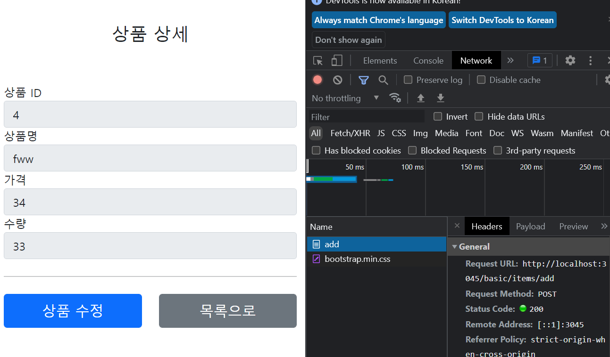
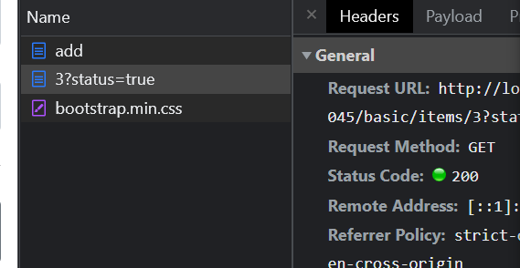

# item-service

test

## PRG 패턴 (Post/Redirect/Get)
 
페이지에서 Data가 SAVE되고 나서, Redirect를 해주지 않으면,
계속해서 같은 URL을 호출하기 때문에 지속적으로 POST에 SAVE 명령을 호출하여 데이터가 저장될 수 있다.


> 단순 Form View로 전송
```java
    @GetMapping("/add")
    public String addForm() {
        return "basic/addForm";
    }
```


### 새로고침
* 새로고침은 가장 마지막에 요청한 URL 방식을 그대로 반복한다. (Get이던, Post이던)

> 나쁜 예

```java
@PostMapping("/add")
public String addItemV2(@ModelAttribute("item") Item item, Model model) {
itemRepository.save(item);

        model.addAttribute("item", item);
        return "basic/item";
    }
```


* /add 명령어로 들어올 때, 그냥 view로 전송해주면, 새로고침시에 계속 Post가 동작하게 된다.
* 새로고침시 위 사진의 POST 명령이 그대로 반복, 계속 생성됨


> 좋은 예

```java
  @PostMapping("/add")
    public String addItemV6(@ModelAttribute("item") Item item, RedirectAttributes redirectAttributes) {
    
        Item savedItem = itemRepository.save(item);
        redirectAttributes.addAttribute("itemId", savedItem.getId());
        redirectAttributes.addAttribute("status", true);

        return "redirect:/basic/items/{itemId}";
    }
```

* /add로 똑같이 요청이 들어올 경우, 그냥 redirect로 Get 요청을 마지막으로 보내게 한다.
* 이럼 새로고침을 할 때, Get요청이 계속 반복된다.



마지막 요청이 redirect로 Get으로 들어갔기 때문에, Get이 반복되어
사용자가 새로고침해도 반복적으로 상품이 등록되지 않는다.

> 그래서 Post -> Post에서 Post -> Redirect-> Get 으로 전환해준다하여 PRG 패턴

---
# 객체를 담아 Redirect후 경우에 따라 화면에 뿌려주는 방법

### RedirectAttribute
리다이렉트시에 따로 추가적인 Page 생성을 할 필요 없이 ,
Model에 담아 전송하는 객체이다.

```java
  @PostMapping("/add")
public String addItemV6(@ModelAttribute("item") Item item, RedirectAttributes redirectAttributes) {

        Item savedItem = itemRepository.save(item);
        redirectAttributes.addAttribute("itemId", savedItem.getId());
        redirectAttributes.addAttribute("status", true);

        return "redirect:/basic/items/{itemId}";
        }
```


* 포인트는 Status같은 값들을 추가적으로 넘겨줘서, 해당 Status가 true일 경우 html을 추가해주는 방법이다.
```html
  <h2 th:if="${param.status}" th:text="|저장 완료|"></h2>
```
